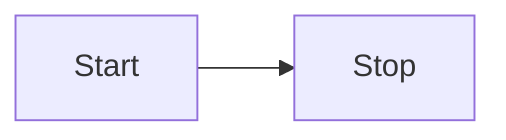

**Please star this repo if it is useful to you. Feel free to fork it as well, but please note that this is designed to work in tandem with Obsidian.**
## Overview

This vault is designed to work with Obsidian notes and contains the notes I've taken and made for the AWS Solutions Architect Associate 2025 exam (SAA-C03).

Given that I've studied a number of these things before without taking the exam, please note that I may not be covering everything. I will, however, endeavour to have this set up to be as logically reasonable as I can.

## The study plan

There are a number of useful resources for the exam. I will list them out and add some comments about each of them:

- [AWS Official Exam Prep](https://skillbuilder.aws/exam-prep/solutions-architect-associate) -- Naturally the official exam prep is the best way to align with exactly what you need to study. Before commencing any study this time, I sat through the 20-question practice exam to get an idea of what sort of things I should study. 
- [Learn Cantrill](https://learn.cantrill.io/courses)-- I took these courses back in 2020 during the pandemic and back then they felt like an amazingly well laid-out course. I can't vouch for the updates in 2025, but hopefully the updated content is as good as before.
- [Udemy | Stephane Maarek's course](https://www.udemy.com/course/aws-certified-solutions-architect-associate-saa-c03) -- Stephane has been teaching the content for years and has thousands of students. I can't imagine this to be a weak resource. My work has a Udemy account, so through this I will likely also be cross-referencing some of Stephane's lessons whenever I don't feel confident.

Naturally, you should also reference the docs where possible. Understanding what you need to learn from the exam and practice the techniques for finding the correct answers. Do not just work through the online courses -- you will learn best by attempting to apply your knowledge through constant exam evaluations.

There are a number of resources for the practice exams:

- https://www.udemy.com/course/practice-exams-aws-certified-solutions-architect-associate/
- https://www.udemy.com/course/aws-certified-solutions-architect-associate-amazon-practice-exams-saa-c03/
- https://www.udemy.com/course/practice-exams-aws-certified-solutions-architect-associate-f/

The second link above relates to Tutorials Dojo, which also has their own website for practice exams (such as [here](https://portal.tutorialsdojo.com/product/aws-certified-solutions-architect-associate-practice-exams/)). I can't speak as of right now whether buying on their website or taking the Udemy version is equivalent, but I'll report back if I find out more.

## My approach

Some of the courses can be as high as 50 hours, and practice exams can take up to an hour depending on how slow you approach it/how many questions you take (it was about 18 minutes for me to take the 20 question practice exam on the AWS skill builder website).

Depending on how comfortable you feel about AWS, you should tailor your needs. I'm planning on taking the exam within the next 25 days if possible, so the plan will be to attempt to commit 2-3 hours each day.

Given that I already have a lot of foundations with AWS and practical experience through my day job, my aim will be to sit practice exams quite regularly (every second day at a minimum) unless it starts to become tedious and to focus on the areas that I get wrong and services that I have the least amount of understanding of. I will be aiming to flag them within these notes as focus events.

## Layout for the notes

The notes should be designed to link within the graph view where possible based on relationships on the notes that I take. I will likely attempt to break down the folders into the different services where applicable, but this can be subject to change.

## Plugins and tools used

Installed will be the Excalidraw and Git plugins to help maintain this vault. I will also rely heavily on Mermaid for creating any useful graphs.

To learn more about the Excalidraw plugin, definitely check this out [https://youtu.be/P_Q6avJGoWI](https://youtu.be/P_Q6avJGoWI)

Within Obsidian, you can see an example at [[Excalidraw Example]].

Most folders should have a top-level "... Board" to help indicate the Excalidraw board used.

## Future

I will endeavour to add my own custom additions for quizzes and notes as I go. I will also likely build out some examples of configurations as TypeScript AWS CDK constructs where possible and where time permits. 